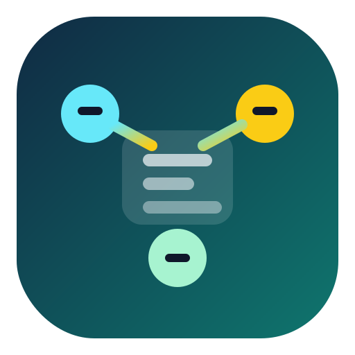

# Agent Teams Creator

<p align="center">
  
</p>

`agent-teams-creator` 是一个基于开放 `SKILL.md` 约定的 agent skill，专门用于分析、设计和实现结构清晰的 agent team runtime。

它不是只给 Codex 使用的仓库，也适合 OpenClaw、Claude Code、Hermes Agent，以及其他能够读取 skill 式 Markdown 指令的智能体工具。

它最核心的价值，是把很多人说不清的 “multi-agent / swarm” 机制拆成真正可落地的三层：

- `task board = 状态`
- `mailbox = 传输`
- `coordinator / team lead = 控制平面`

## 兼容性

这个仓库使用的是更通用的 `SKILL.md` 技能写法，适合在不同智能体工具之间复用。

- 直接适配较好的工具：Codex、OpenClaw、Claude Code、Hermes Agent
- 一般也容易迁移到：支持自定义 skills / 指令包 / Markdown playbook 的其他智能体工具
- 最适合的任务：coordinator-worker 系统、protocol-driven swarm、shared task board、mailbox-driven runtime、verifier 流程

## 它解决什么问题

很多多 agent 设计失败，不是因为模型不够强，而是因为把这些东西混在一起了：

- 谁拥有共享状态
- 谁负责消息传递
- 谁拥有协调和审批权

这个技能会强制把分析或设计输出收束到：

- team bootstrap
- teammate identity
- spawn backends
- mailbox protocol
- shared task board
- coordinator role
- isolation stance
- verifier flow

## 大多数人真正需要它讲清楚的点

很多多 agent 项目看起来很热闹，但机制其实没说清楚。这个 skill 的价值就在于把这些最容易糊掉的点讲明白：

- 什么是共享状态，什么是消息传递
- 谁有分配、审批、阻塞任务的权限
- 什么情况下必须隔离，什么情况下共享工作区就够了
- verifier 为什么不能和实现 worker 混成一个角色
- 怎么避免把系统描述成空泛的 “swarm”

## 压测后的实际效果

基于真实 Codex 工作流做对比测试时：

- 不使用 skill：结果更容易停留在“我看了哪些文件”或泛化 swarm 描述。
- 使用 `$agent-teams-creator`：结果会稳定讲清 coordination spine、协议消息类型、task board 模型、spawn modes、隔离策略和 verification 规则。

## 更直观的前后差异

### 不使用 skill

- 输出可能停留在阅读过程汇报
- “multi-agent” 很容易被讲成泛化 swarm
- task board、mailbox、coordinator 三者的边界容易模糊
- worktree 隔离也容易被说成默认行为

### 使用 `$agent-teams-creator`

- 输出会被强制拉回真正的 team runtime 机制
- task board 会被明确为共享状态
- mailbox 会被明确为传输和协议总线
- team lead / coordinator 会被明确为控制平面
- 默认共享工作区与可选 worktree 隔离会被分开说明
- verification 会被明确成独立阶段，而不是实现 worker 自我宣布完成

## 案例

### 场景：解释一个 agent teams 运行时，并设计一个类似系统

**baseline**
- 有的结果只停在“我读了这些文件”
- 有的结果虽然能回答，但仍然容易把关键协议细节讲得太泛

**使用 skill 后**
- 会稳定覆盖：
  - coordination spine
  - 结构化消息类型
  - spawn modes
  - teammate identity
  - task board 的 owner / blocker 模型
  - coordinator 角色
  - isolation stance
  - verification stance
  - 事实与推断边界

## 安装方式

把仓库克隆到你的技能目录即可。

### 常见技能目录

```text
Codex:       ~/.codex/skills/agent-teams-creator
Claude Code: ~/.claude/skills/agent-teams-creator
OpenClaw:    ~/.openclaw/skills/agent-teams-creator
Hermes:      ~/.hermes/skills/agent-teams-creator
```

如果你的工具更偏向项目内 skills 目录，也可以直接把本仓库放进去，只要保持 `SKILL.md` 在 skill 根目录。

### Windows

```powershell
git clone https://github.com/Arthurescc/agent-teams-creator `
  "$env:USERPROFILE\\.codex\\skills\\agent-teams-creator"
```

### macOS / Linux

```bash
git clone https://github.com/Arthurescc/agent-teams-creator \
  "${HOME}/.codex/skills/agent-teams-creator"
```

如果你同时使用多个智能体，可以把同一个目录复制或软链接到其他 agent 的技能目录。

如果你使用 `CODEX_HOME`，请安装到：

```text
$CODEX_HOME/skills/agent-teams-creator
```

安装后重启或刷新对应智能体，让技能列表刷新。

### Claude Code 安装示例

```bash
git clone https://github.com/Arthurescc/agent-teams-creator \
  "${HOME}/.claude/skills/agent-teams-creator"
```

## 使用示例

- `Use $agent-teams-creator to explain how a protocol-driven agent team runtime should work.`
- `Use $agent-teams-creator to design a coordinator-plus-workers system for this repo.`
- `Use $agent-teams-creator to add a task board and mailbox protocol to our multi-agent runtime.`
- `Use $agent-teams-creator to compare our current swarm design against a stronger team-runtime model.`

## 仓库内容

```text
SKILL.md
agents/openai.yaml
references/
assets/
```

## 使用后最直观的变化

相比泛泛而谈的 multi-agent 描述，使用这个 skill 后，输出通常会更像：

- 可以画出来的 coordination spine
- 可以实现的 protocol
- 可以测试的角色边界和权限边界
- 不依赖 worker 自我验收的 verification 路径

## 开发说明

本项目为自研开发，面向多种 coding agent 的实际技能工作流使用。

重点在于让多 agent 运行时的设计更清晰、更协议化、更适合工程实现。

## 更多技能

总导航页见：[codex-skills-hub](https://github.com/Arthurescc/codex-skills-hub)

## FAQ

### 这是只给 Codex 用的吗？

不是。它采用开放的 `SKILL.md` 结构，目标就是尽量在 Codex、OpenClaw、Claude Code、Hermes Agent 这类工具之间复用。

### 只能用来从零做 multi-agent 系统吗？

不是。你已经有 swarm、coordinator-worker、reviewer loop、shared-task orchestration 系统时，也很适合拿它来重构和梳理机制。

### 为什么一直强调 task board、mailbox、coordinator 的区分？

因为这通常就是最关键、也最容易被说糊的地方。把状态、传输、控制权分开之后，系统会更容易设计、实现和验证。

## License

MIT
